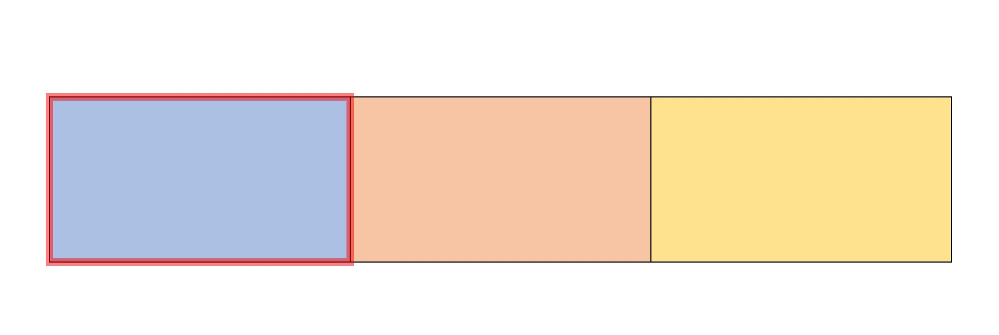
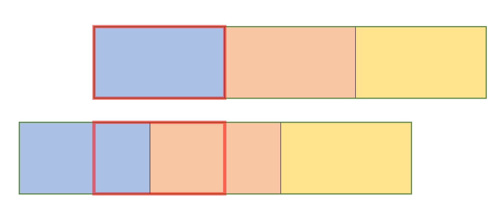
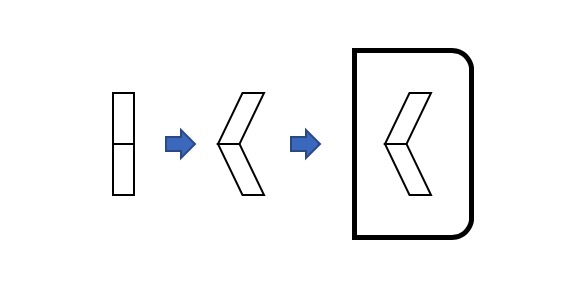

# 轮播图(Carousel)

这一次我们要尝试制作一个简单的轮播图，图纸已经放在了 `drafts` 文件夹底下了

## 制作要求

### 基本要求

1. 轮播图的宽高无论在css上、还是在js上，尽可能以变量的形式存在，因为后期可能会发生变更
2. 轮播图他会每3秒切换到下一张图片
3. 如果已经是最后一张图片，轮播图应该切换回第一张图片(至于动画效果应该是怎样的，你们可以自己决定)
4. 使用 **jQuery** 与 **less**
5. 每次切换一个图片时，下方的三个指示小点点会变换颜色
6. 使用 `transform: skew` 的方法制作平行四边形以拼接翻页箭头

### 进阶要求

1. 在轮播图上有一个向前和向后的按钮，一点会向前翻或向后翻
2. 点击下方的指示小点点也能切换到相应的图片

> tips: 每一次点击完以后，应该清空原有的计时器，重新开始计时，不然的话会很难看

## 制作思路

1. 轮播图的布局
主要容器应该是一个设置了 `overflow:hidden` 的容器，其中可以横向排列多张图片，每张图片的宽度应该和轮播图容器的宽度一致(100%)


> 在制作轮播图时，建议选几张宽高都不一致的图片，你会发现新的问题需要解决

2. 轮播图怎么会动呢？
我们将上图中三张图片再用一个容器 *(inner-container)* 包起来，我们每一次只需要改变这个容器 *(inner-container)* 的位置就可以了。


改变位置的方法有很多

  2.1. 将 *(inner-container)* 进行绝对定位

```js
$('.inner-container').css('left','-100px');
```
  2.2. 使用 `transform`

```js
$('.inner-container').css('transform','translateX(-100px)');
```
如果你使用如上代码去进行div的位移，那么这个位置变化是瞬间的，所以还需要配合使用：

```css
.inner-container{
    transition:all .3s;
}
```

> 思考：上面这个过渡时间如果大于轮播图切换时间会发生什么？

每三秒执行一次变换，就使用 `setInterval(function(){},3000)` 这个方法呀，具体逻辑自己想！反正就是每次都让它移动一段距离

3. 翻页按钮的制作

翻页按钮应该是三个 `div` 组成，一个是翻页按钮本身，两个是组成箭头的 `div`。
如果你觉得自己有能力，可以尝试直接使用 `::after` 和 `::before` 做到只使用一个 `div` 来完成。


根据制作要求，我们要求使用 `transform:skew` 来完成图标的制作，而需要注意的是，在 skew 这个函数中参数的单位应该是 `deg` 而不是 `px`
你可以先尝试一下这段代码的效果

```html
<div class="up"></div>
<div class="bottom"></div>
<style>
div {
    width: 10px;
    height: 30px;
}

.up {
    transform: skew(-20deg);
    background-color: skyblue;
}

.bottom {
    transform: skew(20deg); 
    background-color: pink;
}
</style>
```

4. 一些单词

- 我猜我们在开发这个功能是一定会有一个变量用来存放当前显示的是第几张图片，我们统一这个变量叫做 `currentPicIndex`。
- 轮播图的英文单词是 **Carousel** 或 **Slide**
- 下方几个指示点的英文单词是 **Indicator**
- 翻页按钮的英文单词是 **Pager**

**that's all**
